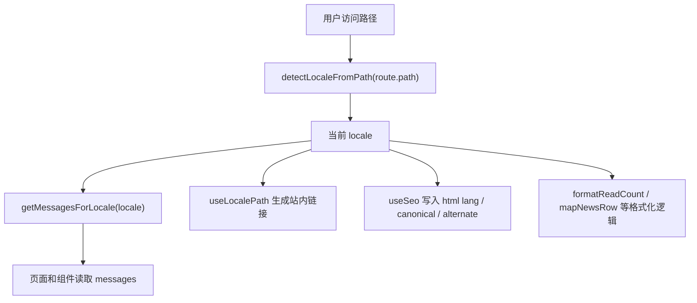

# 国际化与全局 CSS 设计文档

## 1. 文档目标

本文档用于梳理当前项目的国际化方案与全局 CSS 设计思路，帮助后续新增页面、维护文案、调整视觉风格时保持一致。

当前项目是 Nuxt 应用，核心设计取向是：

- 国际化采用轻量自研方案，不引入额外 i18n 模块。
- 中文为默认语言，英文通过 `/en` 路由前缀访问。
- 页面结构复用同一套 Vue 组件，通过文案字典和路由工具切换语言。
- 全局 CSS 负责设计 token、基础重置、通用组件类和动画能力。
- 页面专属视觉放在组件 scoped style 或独立页面 CSS 中，避免全局样式膨胀。

## 2. 国际化设计

### 2.1 目录与文件职责

| 文件                               | 职责                                                                           |
| ---------------------------------- | ------------------------------------------------------------------------------ |
| `app/i18n/schema.ts`               | 定义国际化文案的数据结构，保证中英文文案字段一致。                             |
| `app/i18n/locales/zh-CN.ts`        | 中文文案数据，当前默认语言。                                                   |
| `app/i18n/locales/en-US.ts`        | 英文文案数据。                                                                 |
| `app/i18n/utils.ts`                | 语言常量、路由前缀处理、文案获取、插值、阅读数格式化、新闻分类映射等基础工具。 |
| `app/composables/useLocale.ts`     | 页面和组件使用的国际化入口，提供当前语言、文案、翻译函数和语言切换能力。       |
| `app/composables/useLocalePath.ts` | 生成当前语言下的站内链接。                                                     |
| `app/composables/useSeo.ts`        | 写入页面 SEO、`lang`、canonical、alternate 等信息。                            |
| `app/pages/en/**`                  | 英文路由镜像页，复用中文路由同一套页面组件。                                   |

### 2.2 路由策略

项目采用“默认语言无前缀，英文加 `/en` 前缀”的策略：

- 中文首页：`/`
- 英文首页：`/en`
- 中文新闻页：`/news`
- 英文新闻页：`/en/news`
- 中文联系页：`/contact`
- 英文联系页：`/en/contact`

语言判断逻辑集中在 `detectLocaleFromPath(path)`：

- 当路径是 `/en` 或以 `/en/` 开头时，返回 `en-US`。
- 其他路径返回 `zh-CN`。

路径生成逻辑集中在 `buildLocalePath(path, locale)`：

- 切换到英文时自动加 `/en`。
- 切换到中文时移除 `/en`。
- 保留 query 和 hash。

这样做的好处是页面组件不需要关心具体前缀，只要使用 `localePath('/news')` 即可生成正确链接。

### 2.3 文案模型

项目没有把文案散落在组件中，而是集中维护在 `LocaleMessages` 类型里。当前结构按业务模块划分：

- `common`：站点名、语言名、通用提示、作者、阅读后缀。
- `nav`：导航菜单和语言切换文案。
- `footer`：页脚、备案、公安全文案。
- `home`：首页 hero、公司介绍、数据、服务、CTA、案例、品牌。
- `contactSection` / `contactPage`：联系模块和联系页。
- `franchise`：创业加盟页面。
- `careers`：人才招聘页面。
- `news`：新闻列表、详情、分享、相关推荐等文案。

文案通过 TypeScript 类型约束，因此新增字段时必须同步更新：

1. 在 `schema.ts` 中增加字段定义。
2. 在 `zh-CN.ts` 中补中文文案。
3. 在 `en-US.ts` 中补英文文案。
4. 在组件中通过 `messages.value.xxx` 或 `t('xxx.yyy')` 使用。

### 2.4 页面复用方式

当前英文页面并没有复制一套完整业务逻辑，而是让中英文路由复用同一套页面组件。例如：

- `app/pages/index.vue` 和 `app/pages/en/index.vue` 都渲染 `HomePage`。
- `app/pages/contact.vue` 和 `app/pages/en/contact.vue` 都渲染 `ContactPageView`。

这种方式能保证：

- 页面结构、交互逻辑、样式行为一致。
- 中英文差异只存在于文案、SEO、链接前缀和少量格式化逻辑。
- 后续改页面时只改一处组件，避免双份代码漂移。

### 2.5 运行时数据流



### 2.6 语言切换

语言切换入口在 `AppHeader.vue`：

- 桌面端使用下拉菜单。
- 移动端使用语言按钮。
- 点击后调用 `switchLocale(targetLocale)`。

`switchLocale` 会做两件事：

1. 在客户端把目标语言写入 `localStorage`，key 为 `hongbo-locale`。
2. 使用 `buildLocalePath(route.fullPath, targetLocale)` 跳转到目标语言路径。

当前语言最终仍以路由为准，`localStorage` 更像是语言偏好记录。

### 2.7 SEO 国际化

SEO 分两层处理：

- `app/app.vue` 写入全局 canonical、alternate、`x-default` 和基础 `lang`。
- 各页面通过 `useSeo()` 写入页面标题、描述、关键词、OG、Twitter、canonical、alternate。

页面级 SEO 通常从国际化文案中读取：

```ts
useSeo({
  title: messages.value.home.seoTitle,
  description: messages.value.home.seoDescription,
  locale: locale.value,
  siteName: messages.value.common.siteName,
})
```

这样可以确保中英文页面拥有各自的标题、描述和 `og:locale`。

### 2.8 动态内容处理

新闻列表和新闻详情的数据来自接口，项目通过 `mapNewsRow(row, locale.value)` 将接口数据映射成页面展示模型。

与语言相关的动态处理包括：

- 阅读数：`formatReadCount(count, locale)`，中文使用“万”，英文使用 `K`、`M`。
- 分类兜底：`getNewsCategoryLabel(typeId, locale)` 根据当前语言返回分类名。
- 新闻详情 SEO：在数据加载成功后基于文章标题、摘要、标签动态写入。

### 2.9 新增国际化页面流程

新增一个需要国际化的页面时，建议按以下步骤：

1. 在 `app/components/pages/` 新增页面视图组件，例如 `ExamplePageView.vue`。
2. 在 `app/pages/example.vue` 渲染该页面视图。
3. 在 `app/pages/en/example.vue` 渲染同一个页面视图。
4. 在 `schema.ts` 中增加该页面的文案结构。
5. 在 `zh-CN.ts` 和 `en-US.ts` 中补齐同名字段。
6. 页面内部使用 `useLocale()` 读取 `messages` 和 `locale`。
7. 页面链接使用 `useLocalePath()`，不要手写 `/en`。
8. 页面 SEO 使用 `useSeo()`，canonical 和 alternate 使用 `buildLocalePath()`。

### 2.10 国际化维护原则

- 不在模板中硬编码可见文案，除非它是品牌固定名或业务明确要求不翻译。
- 不在组件里判断 `/en` 字符串，统一使用 `useLocale()` 或 `detectLocaleFromPath()`。
- 不手写英文链接前缀，统一使用 `localePath()` 或 `buildLocalePath()`。
- 新增文案先更新类型，再补全中英文文件。
- 同一页面的中英文路由尽量复用同一个 page view 组件。
- 与语言相关的格式化逻辑放在 `app/i18n/utils.ts` 或专门的业务映射函数中。

## 3. 全局 CSS 设计

### 3.1 样式加载入口

全局样式在 `nuxt.config.ts` 中配置：

```ts
css: ['~/assets/css/theme.css', '~/assets/css/animations.css']
```

加载顺序表示：

1. `theme.css` 先提供设计变量、基础重置和通用组件类。
2. `animations.css` 再提供动画 keyframes、页面过渡类和动效类。

### 3.2 样式分层

当前项目样式分为四层：

| 层级        | 位置                                         | 职责                                                                       |
| ----------- | -------------------------------------------- | -------------------------------------------------------------------------- |
| 设计系统层  | `app/assets/css/theme.css`                   | CSS 变量、基础重置、容器、标题、按钮、卡片、标签、工具类、响应式基础规则。 |
| 动效层      | `app/assets/css/animations.css`              | 全局 keyframes、页面切换动画、可复用动效类。                               |
| 工具类层    | `uno.config.ts`                              | UnoCSS preset、图标、字体、快捷类、动效 shortcut。                         |
| 组件/页面层 | Vue `style scoped` 或 `app/pages/news/*.css` | 页面布局、业务视觉、特殊交互状态。                                         |

### 3.3 `theme.css` 设计思路

`theme.css` 是项目的设计 token 和通用 UI 语言中心，主要包含：

- 主色系统：`--color-primary`、`--color-secondary`。
- 文本色：主文本、次级文本、浅色文本、白色文本。
- 背景色：白底、灰底、浅色底、深色底、深色渐变。
- 边框色：普通边框、浅边框。
- 字体系统：字体族、字号、行高、字重。
- 间距系统：从 `xs` 到 section 级间距。
- 圆角系统：小、中、大、超大、全圆角。
- 阴影系统：小、中、大、发光阴影。
- 过渡系统：快、标准、慢。
- 容器系统：`--container-width`、`--container-padding`。

通用类包括：

- `.container`：统一最大宽度和左右留白。
- `.section`：统一区块上下间距。
- `.section-kicker`、`.section-title`、`.section-subtitle`：统一内容区块标题结构。
- `.page-title`、`.card-title`、`.text-body`、`.text-muted`：统一文字层级。
- `.card`、`.card--dark`、`.card--icon`、`.card--stat`：通用卡片模式。
- `.btn`、`.btn--primary`、`.btn--secondary`、`.btn--outline` 等：通用按钮模式。
- `.tag`、`.divider`、`.text-center`、`.mt-*`、`.mb-*`：常用辅助类。

响应式规则主要通过 CSS 变量下沉：

- `768px` 以下降低 section 间距和卡片内边距。
- `480px` 以下进一步缩小 section 间距、容器边距、按钮和 kicker 尺寸。

这种方式能让页面组件不用重复写大量基础响应式规则。

### 3.4 `animations.css` 设计思路

`animations.css` 用于承载全局动效能力，避免每个组件重复定义 keyframes。

当前包含：

- 基础进入动画：`fadeInUp`、`fadeInRight`、`fadeIn`。
- `.wow`、`.fadeInUp` 等旧模板兼容类。
- Nuxt 页面过渡：`.page-enter-*`、`.page-leave-*`。
- Nuxt 布局过渡：`.layout-enter-*`、`.layout-leave-*`。

`nuxt.config.ts` 中的页面过渡配置会与这些 class 对应：

```ts
pageTransition: { name: 'page', mode: 'out-in' },
layoutTransition: { name: 'layout', mode: 'out-in' },
```

### 3.5 UnoCSS 的角色

项目同时启用了 UnoCSS，配置在 `uno.config.ts`。

UnoCSS 在当前项目中的定位是：

- 提供原子类能力，用于快速处理局部布局和状态。
- 提供 `presetIcons`，配合图标类使用。
- 提供字体 preset。
- 提供 shortcuts，例如 `hover-lift`、`hover-lift-lg`、`shine-hover`、`anim-*`。

与全局 CSS 的关系是：

- 品牌色、标题、按钮、卡片等稳定视觉优先放在 `theme.css`。
- 一次性布局和轻量状态可以使用 UnoCSS。
- 复杂页面视觉仍建议写 scoped CSS，便于阅读和维护。

### 3.6 页面和组件样式策略

当前组件大多使用 `<style scoped>`，例如：

- `AppHeader.vue`：导航、语言切换、移动端菜单。
- `HomePage` 下的各区块组件：公司介绍、服务、案例、CTA 等。
- `FranchisePageView.vue`、`CareersPageView.vue`：页面级复杂视觉。

新闻页样式拆到了独立 CSS：

- `app/pages/news/list-page.css`
- `app/pages/news/detail-page.css`

然后通过 scoped style 引入：

```vue
<style scoped src="../../pages/news/list-page.css"></style>
```

这是因为新闻列表和详情样式较长，拆成独立文件能降低 Vue 单文件组件的阅读压力。

### 3.7 全局 CSS 使用原则

新增样式时建议按以下规则判断放在哪里：

| 场景                                         | 推荐位置                            |
| -------------------------------------------- | ----------------------------------- |
| 品牌色、字号、间距、圆角、阴影等 token       | `theme.css` 的 `:root`              |
| 多个页面都会复用的标题、按钮、卡片、标签模式 | `theme.css`                         |
| 多页面可复用 keyframes 或页面切换动画        | `animations.css`                    |
| 单个组件专属布局或视觉                       | 组件 `<style scoped>`               |
| 单个页面样式很长，影响 SFC 阅读              | 独立 CSS 文件并通过 scoped src 引入 |
| 一次性微调、布局组合、hover shortcut         | UnoCSS 类或 shortcut                |

不建议：

- 在组件里重复定义全局已有 token。
- 为单个页面样式污染全局 class。
- 在多个组件里复制同一段 keyframes。
- 在模板中混用大量硬编码颜色，优先使用 CSS 变量。
- 为一次性样式新增全局工具类。

### 3.8 与布局的关系

全局应用入口 `app/app.vue` 设置了：

- `html`、`body`、`#__nuxt` 高度。
- 全局 margin 和 padding 清零。
- dark 模式的 `color-scheme`。

默认布局 `app/layouts/default.vue` 设置：

- 顶部 `AppHeader`。
- 中间 `main`。
- 底部 `AppFooter`。
- `main` 预留 `padding-top: 70px`，匹配 fixed header 高度。

因此页面组件通常不需要自己处理 header 占位，除非是首页 hero 这种需要和透明导航产生视觉联动的特殊场景。

## 4. 维护建议

### 4.1 国际化建议

- 继续保持“路由即语言状态”的模型，避免再引入一套全局语言状态源。
- 新增语言前，先扩展 `LocaleCode`、`localeMessages`、`localeNames` 和路径策略。
- 对表单校验、接口错误、空状态等文案统一收敛到 `LocaleMessages`。
- 动态接口如果未来返回多语言字段，可以在 `mapNewsRow` 一类映射层做语言选择，不建议让页面模板直接判断。

### 4.2 CSS 建议

- `theme.css` 当前约 500 行，仍在可维护范围内；后续如果继续增长，可按 token、base、components、utilities 拆分。
- `app/pages/news/detail-page.css`、`FranchisePageView.vue` 已超过 700 行，后续继续改动时建议优先拆分为更小的区块组件或独立样式文件。
- 新增页面优先复用 `.section-title`、`.section-subtitle`、`.btn`、`.card` 等基础类，减少重复设计。
- 页面级强视觉可以保留 scoped CSS，但颜色、阴影、间距尽量引用 `var(--color-*)`、`var(--spacing-*)`。
- 如需新增动画，优先判断是否是跨页面通用动效；通用动效放 `animations.css`，单页动效放页面 scoped CSS。

## 5. 当前方案总结

当前项目的国际化方案偏轻量、可控，适合官网类项目：

- 路由层面清晰，中文默认，英文 `/en`。
- 文案层面类型化，减少中英文字段不一致。
- 组件层面复用度高，避免维护两套页面。
- SEO 层面对 canonical、alternate、`lang` 有明确处理。

当前全局 CSS 方案也符合官网维护习惯：

- `theme.css` 提供统一视觉基础。
- `animations.css` 管理全局动效。
- UnoCSS 负责工具类和快捷类。
- scoped CSS 承接页面级视觉表达。

后续维护的关键是继续保持边界清晰：通用能力上收，页面特殊性下沉；文案进 i18n，链接走 locale path，样式优先复用 token。
